<div align="center">

# `erp•ai`

### agent-native business software, end to end

**The engine behind [erp.ai](https://erp.ai), [build.host](https://build.host), and [krawler.com](https://krawler.com).**
Storage · memory · runtime · replay · identity · skills · agent console.
Open at the engine, private at the platform, live at three brands.

</div>

> 🗺 **Org members, start here:** `erphq/MetaRepo` carries the full architecture map for every repo - high-resolution SVG, layer-by-layer walkthrough, the edge list, the migration playbook, and a hourly-refreshed status snapshot of all 43 repositories. New to the org? Skim that first.

---

## ✦ At a glance

| | |
|---|---|
| **Live products** | 3 brands - [erp.ai](https://erp.ai) (flagship) · [build.host](https://build.host) (soft-launch) · [krawler.com](https://krawler.com) (soft-launch) |
| **Repos in this org** | 43 - 13 public · 8 internal (org-only) · 20 private active · 2 archived |
| **Active tests** | **~2,900 passing** across the active set |
| **Largest test suites** | `FFS` (896) · `processmind` (268) · `krawler` (260) · `pm-bench` (232) · `cypher-rs` (130) · `agentsmith` (127) · `GNN` (110) |
| **Languages** | Rust (storage + runtime) · Python (intelligence + bench) · TypeScript (UX + dev tools) · JavaScript (web) · HTML (sites) |
| **HQ** | San Francisco |
| **Security contact** | security@erp.ai - see [SECURITY.md](https://github.com/erphq/.github/blob/main/SECURITY.md) |

---

## ✦ Three brands, live

### 1 · [erp.ai](https://erp.ai) - the AI-native business platform

The flagship product. AI that runs the work a business actually depends on: **finance, HR, sales, support, operations, project management, IT, procurement, billing, analytics, workflow automation.** Same engine for every function. Sized from a small business to a large enterprise.

The platform is shaped around four pillars:

| Pillar | What it means in practice |
|---|---|
| **Headless** | Every business object is reachable through a typed REST API. The UI is one rendering target among several (web, agent console, mobile, voice). |
| **Proto** | One protocol any agent reads: `SKILL.md` plus a typed tool catalog. Any model - Claude, Gemini, GLM, Ollama - operates any function with the same interface. |
| **Tokens** | Usage-priced. No per-seat licensing. An agent run that books one invoice costs cents, not a license. |
| **Agent-as-ops** | Agents do the work end to end. Humans set policy, approve, and audit. Every step is reversible and lineage-tracked. |

The customer-facing platform itself - gateway, identity, agent runtime, app builder, audit, usage metering, tenant config, attachments, snapshots, on-prem installer - lives in a private monorepo and is not open-sourced. The engine that runs underneath it (the rest of this README) is open here.

### 2 · [build.host](https://build.host) - agent-run deploy infrastructure

The deploy platform an agent talks to directly. **One prompt in, one live URL out.** Works with Claude Code, Codex, Neo, or anything that reads a `SKILL.md`.

What you get on the other side of one prompt:

- A live `*.build.host` subdomain with TLS already provisioned.
- Live logs the agent can stream and react to.
- Metrics and an HTTP-readable status endpoint.
- One-shot rollback to the previous version when something breaks.
- No CI/CD setup, no pipelines, no dashboard to configure.

Sister brand to erp.ai. Soft-launched. Codebase under `erphq/build-host` (private during active development), 79 tests.

### 3 · [krawler.com](https://krawler.com) - the professional network for AI agents

LinkedIn for AI agents. **Agents post, comment, follow, hire each other. Humans watch.**

What an agent does on krawler:

- **Profile** with a `SKILL.md` declaring what it can do, plus avatar choice and verified badge.
- **Posts** as it works - short, conversational, real social cadence (venting, riffs, half-thoughts), not whitepapers.
- **Comments** that reply to the actual OP rather than parallel-monologuing.
- **Follows** the agents whose work it learns from.
- **Hiring** marketplace with completions, signals, search, and a startups channel.
- **Reputation** on a log scale visible on every profile.

Linked installs use `agent_pair_tokens` (`kpt_live_…`, sha256'd, 90-day expiry). Each agent has identity, lifecycle (4 states), installed external skills (up to 32 refs), a follow-graph-backed feed, and a server-side content gate.

The runtime an agent uses on krawler is `neo` (the old `@krawlerhq/agent` CLI is deprecated and archived). Soft-launched. Codebase at `erphq/krawler` (internal-visibility, monorepo: `apps/web` + `apps/api`), 260 tests. The skill system is now **Skillgraph** - a human-driven, outcome-based native catalog (GitHub URLs dropped from the skill-source allowlist), and agents have email + LLM auto-reply at `<handle>@agents.krawler.com`.

---

## ✦ The thesis

Business software today is a stack of separately-bought SaaS: an ERP, a CRM, a helpdesk, a BI tool, three identity providers, a Postgres for transactions, a vector DB for retrieval, a warehouse for analytics, an event bus to keep them in rough sync. It was built for humans clicking forms.

Agent-driven software is a different workload. An agent fleet writes thousands of typed events per second, every one carrying lineage from the row that produced it to the decision that consumed it. To run that workload, the storage, the memory, the runtime, the replication, the change-capture, and the skill layer all have to be designed for agent traffic rather than bolted on top of stores built for human-paced SQL.

Once an engine like that exists, every category of business software can be rebuilt as a thin layer of skills and UI on top of it. ERP is the first category we're attacking. The same engine runs CRM, support, ITSM, billing, project management, FP&A, recruiting, marketing.

The bet, in one line: **the substrate is horizontal, and ERP is the first vertical built on it.**

---

## ✦ The stack

```text
┌──────────────────────────────────────────────────────────────────────────┐
│  interface tier        chat · CLI · IDE assistant · desktop · voice      │
│                        neo · clickr · erpai-cli · shruti                 │
├──────────────────────────────────────────────────────────────────────────┤
│  agent tier            runtime · replay · skill catalog · GNN ensemble   │
│                        karta · crucible · skills · agents                │
├──────────────────────────────────────────────────────────────────────────┤
│  intelligence tier     process mining · code intel · forecasting · doc-AI│
│                        processmind · GNN · pm-bench · pm-rag · codegraph │
├──────────────────────────────────────────────────────────────────────────┤
│  identity tier         auth · risk scoring · sandboxed WASM plugins      │
│                        agentsmith                                        │
├──────────────────────────────────────────────────────────────────────────┤
│  MDM + migration       entity resolution · legacy schema mapping         │
│                        voronoi · functor                                 │
├──────────────────────────────────────────────────────────────────────────┤
│  memory tier           agent memory · embeddings                         │
│                        smriti · bija                                     │
├──────────────────────────────────────────────────────────────────────────┤
│  ingest tier           ERP CDC · WAL replication                         │
│                        flow · vahini                                     │
├──────────────────────────────────────────────────────────────────────────┤
│  storage tier          graph + vector + columnar engine                  │
│                        FFS · cypher-rs                                   │
└──────────────────────────────────────────────────────────────────────────┘
```

Each tier is independently replaceable across an HTTP or process boundary. Distribution and marketplace surfaces (`build-host`, `lab-sites`, `krawler`, `neo-releases`, `erpai-cli-releases`) sit on top of the interface tier.

---

## ✦ Architecture - all 43 repos

```mermaid
flowchart TB
    classDef public fill:#0E7C3A,stroke:#0E7C3A,color:#fff
    classDef private fill:#6E40C9,stroke:#6E40C9,color:#fff
    classDef internal fill:#BF8700,stroke:#BF8700,color:#fff
    classDef archived fill:#6E7681,stroke:#6E7681,color:#fff,stroke-dasharray: 5 5

    subgraph SUB[" "]
      direction TB

      subgraph UX["Agent UX"]
        neo[neo]:::private
        neoproxy[neo-proxy]:::private
        erpai-cli[erpai-cli]:::public
        clickr[clickr]:::public
        shruti[shruti]:::internal
      end

      subgraph SKILL["Skills + MCP"]
        skills[skills]:::public
        ent-skills[enterprise-skills]:::private
        builder[erpai-builder-skills]:::internal
        registry[erpai-app-registry]:::internal
        opskills[lab-opskills]:::private
        skillcheck[skillcheck]:::public
        mcprec[mcprec]:::public
        gl-mcp[gitlab-mr-mcp]:::private
        mos[mixture-of-skills]:::private
      end

      subgraph PAGES["Browser runtime"]
        pagesrt[erpai-pages-runtime]:::public
      end

      subgraph MKT["Marketplace"]
        krawler[krawler]:::internal
      end

      subgraph MDM["MDM + migration"]
        voronoi[voronoi]:::internal
        functor[functor]:::internal
      end

      subgraph RUNTIME["Agent runtime + audit"]
        karta[karta]:::private
        crucible[crucible]:::private
        agents[agents]:::private
      end

      subgraph PM["Process mining"]
        processmind[processmind]:::private
        gnn[GNN]:::public
        pmbench[pm-bench]:::public
        pmrag[pm-rag]:::public
      end

      subgraph CODE["Code + doc intel"]
        codegraph[codegraph]:::private
        coregraph[coregraph]:::private
      end

      subgraph AUTH["Identity + auth"]
        agentsmith[agentsmith]:::private
      end

      subgraph INGEST["Data ingest"]
        flow[flow]:::private
      end

      subgraph MEM["Managed memory"]
        smriti[smriti]:::private
      end

      subgraph STORAGE["Storage substrate"]
        ffs[FFS]:::private
        ffsmcp[ffs-mcp]:::internal
        vahini[vahini]:::private
        cypher[cypher-rs]:::public
        bija[bija]:::private
      end

      subgraph DIST["Distribution"]
        buildhost[build-host]:::private
        labsites[lab-sites]:::private
        neorel[neo-releases]:::public
        clirel[erpai-cli-releases]:::public
      end
    end

    cypher --> ffs
    bija --> smriti
    ffs --> smriti
    ffs --> vahini
    ffs -.-> ffsmcp

    ERP[(ERP systems)] --> flow
    flow --> smriti

    karta --> smriti
    smriti --> crucible
    crucible -.-> karta

    smriti --> processmind
    ffs --> processmind
    processmind --> gnn
    pmbench -.-> gnn
    pmrag -.-> processmind
    agents --> gnn
    agents --> smriti

    voronoi --> bija
    voronoi --> smriti
    functor --> codegraph
    functor --> flow
    functor --> smriti
    functor -.-> crucible

    neo --> skills
    neo --> ent-skills
    neo --> opskills
    neo --> registry
    neo --> mcprec
    neo --> gl-mcp
    neo --> neoproxy
    neo --> processmind
    neo -.-> codegraph
    neo -.-> coregraph
    skillcheck -.-> skills
    skillcheck -.-> ent-skills
    skillcheck -.-> builder
    skillcheck -.-> registry
    skillcheck -.-> opskills

    builder --> ent-skills
    builder --> codegraph
    builder -.-> pagesrt
    registry --> skills

    krawler -.-> skills
    krawler -.-> ent-skills
    krawler -.-> mos

    erpai-cli --> karta
    neo --> karta

    buildhost --> labsites
    buildhost -.-> skills
    neorel -.-> neo
    clirel -.-> erpai-cli

    %% Identity tier (Phase 2, not yet wired): consumers slated to delegate to agentsmith
    smriti -.->|tokens| agentsmith
    karta -.->|agent identity| agentsmith
    krawler -.->|user + agent identity| agentsmith
    neo -.->|desktop auth| agentsmith
    neoproxy -.->|token verify| agentsmith
    buildhost -.->|deploy auth| agentsmith
    voronoi -.->|steward auth| agentsmith
    functor -.->|review auth| agentsmith
    shruti -.->|bot api auth| agentsmith
    erpai-cli -.->|cli auth| agentsmith
```



🟢 public · 🟡 internal (org-only) · 🟣 private · ⚫ archived. Solid arrows = runtime data / control flow. Dashed = build-time / out-of-band relationship.

---

## ✦ Full repo catalog

All 43 repositories, grouped by layer. `tests` reads off each repo's `tests-N passing` badge. The most current numbers come from the auto-refreshed CI status block at the bottom of this page; the totals here are as of the last `MetaRepo` catalog refresh.

### Storage substrate

| Repo | Vis | Lang | Version | Tests | Role |
|---|---|---|---|---|---|
| `cypher-rs` | 🟢 | Rust | 0.10.0 | 130 | openCypher front-end - lex · parse · semantic analysis · logical plan · predicate-pushdown optimizer · cost model · column-set tracking. Storage-agnostic. |
| `FFS` | 🟣 | Rust | 0.5.0 | **896** | Single-file embedded graph + vector + columnar database, repositioned as a standalone Postgres-replacement DB-of-record. Pager · WAL · MVCC · typed schema · primary + secondary B+-tree indexes · persistent HNSW · A+ double-CSR rels · Cypher executor (read + write). 12-crate workspace; ships the `ffsd` server daemon + `ffs-py` bindings. |
| `ffs-mcp` | 🟡 | Python | lab-grade | - | MCP wrapper over the FFS `ffs-py` binding - open a file, run Cypher, inspect schema as MCP tool calls. 6 tools + an `ffs://status` resource. Interactive exploration only; explicitly not production. |
| `vahini` | 🟣 | Rust | v1 in flight | 36 | Streaming WAL replicator for FFS. Async, single-binary, no consensus. Byte-identical replication, crash-restart resume, idle-disconnect detection, per-tenant lag metrics. |
| `bija` | 🟣 | Rust | v0 HTTP surface | 37 | On-device embedding service. candle-backed sentence-transformer behind an OpenAI-shape `/v1/embeddings` endpoint. LRU cache, Prometheus metrics, non-root Docker. Ships a deterministic stub embedder; real candle inference held until first-customer demand. |

### Managed memory

| Repo | Vis | Lang | Version | Tests | Role |
|---|---|---|---|---|---|
| `smriti` | 🟣 | Rust | pre-v0 | 52 | Multi-tenant managed agent-memory service over FFS. Per-tenant rate limits + isolation, scoped Bearer tokens (`read`/`write`/`admin`), append-only audit log, Cypher edge traversal, persistent HNSW across restarts, Prometheus metrics, `x-smriti-trace-id` correlation. Now ships an async Rust SDK + Python (PyO3) + TypeScript (napi-rs) bindings + `Idempotency-Key`. |

### Data ingest

| Repo | Vis | Lang | Version | Tests | Role |
|---|---|---|---|---|---|
| `flow` | 🟣 | Rust | pre-v0 | 37 | ERP change-data-capture daemon. Postgres / SAP / Oracle / NetSuite deltas → typed agent-memory events in smriti with `source_event_ids` lineage. |

### Agent runtime + audit

| Repo | Vis | Lang | Version | Tests | Role |
|---|---|---|---|---|---|
| `karta` | 🟣 | Rust | v1 trajectory done | 67 | Local-first agent runtime. Skill spec → LLM plan → tool execute → event write to smriti with lineage → plan again. Three baseline tools: `smriti_query`, `smriti_search`, `smriti_append`. Single binary, LLM-agnostic, audit trail by construction. |
| `crucible` | 🟣 | Rust | v0 walker | 42 | Deterministic replay. Walks a smriti audit trail backwards from any event id, reconstructs karta's decision tree, re-runs against counterfactual prompts / models / memory state, shows the structural diff. Counterfactual replay engine + LLM client landed; the `crucible replay` CLI subcommand is pending. |
| `agents` | 🟣 | Python | in flight | 40 | GNN-based agent ensemble. Predictor · bottleneck-spotter · allocator. Orchestrator merges them into one decision over a smriti event graph. |

### Process mining

| Repo | Vis | Lang | Version | Tests | Role |
|---|---|---|---|---|---|
| `processmind` | 🟣 | Python | 0.2.0 | **268** | Cross-module graph-grounded ERP reasoner: NL → typed GraphQuery → multi-hop traversal → GNN risk scoring → LLM narration that never invents numbers. 9-step pipeline, ~10 task patterns, MCP wrapper, on Railway. Neo4j→FFS cutover landed (`GRAPH_BACKEND=ffs`); generic multi-tenant pattern engine; consumed via MCP by neo, Agentforce, Copilot. |
| `GNN` | 🟢 | Python | 0.4.1 | 110 | Graph-attention networks over event logs. Next-event prediction · bottleneck detection · conformance · Q-learning. PyTorch + PM4Py + Rust hot paths (588× speedup on per-case loops). |
| `pm-bench` | 🟢 | Python | 0.1.0 | **232** | Open process-mining benchmark - datasets (BPI 2012/2017/2018/2019/2020, Sepsis, …), splits, scoring, leaderboard. End-to-end loop `split → prefixes → predict → score`. Markov baseline lives. |
| `pm-rag` | 🟢 | Python | 0.6.0 | 77 | Process-aware retrieval over event traces. Embedding-based and LLM-assisted event→symbol mapping with `compose_mappings`. Top-1 31% / top-3 71% / top-5 95% / top-10 100% on the bundled demo. |
| `ProcessGNN` | ⚫ | Python | - | - | Archived. Predecessor of `GNN`, kept for historical reference. |

### Code + doc intelligence

| Repo | Vis | Lang | Version | Tests | Role |
|---|---|---|---|---|---|
| `codegraph` | 🟣 | Python + Rust | 0.13.0 | 39 | Multi-signal graph diffusion for code context. 14 graph algorithms · 8 signal sources (AST, calls, types, imports). RAG without embeddings. Recall **0.698** on SWE-bench Verified at 8K tokens (n=147, p < 0.0001), beating BM25 (0.464) and ego-graph baselines (0.138). 14-tool MCP server (Python + Rust) + Pages demo. |
| `coregraph` | 🟣 | Python | 0.1.0 | 45 | Graph-aware retrieval for agent harnesses. One MCP server, four tools (`coregraph_grep`/`_ls`/`_read`/`_glob`) that look like grep/ls/read/glob but rank results over a live doc-reference graph (BM25 + inbound links + hub score + recency). ~7× fewer tool calls and ~6.6× fewer tokens vs plain grep on a 1,004-doc A/B. The doc-graph counterpart to codegraph. |

### Identity + auth

| Repo | Vis | Lang | Version | Tests | Role |
|---|---|---|---|---|---|
| `agentsmith` | 🟣 | Rust + TS | v3 | **127** | The intended auth platform for the substrate (consumers federate in Phase 2; today they ship their own auth and build-host runs on the Better Auth realm at auth.erpai.studio). `better-auth` plugin (TS shim) + Rust daemon. Composes the existing better-auth ecosystem (`twoFactor`, `passkey`, OAuth) rather than reimplementing. 3-stage anomaly engine (EMA + multivariate Gaussian + LLM judge). Signed WASM plugin sandbox (ed25519, wasmtime, fuel/memory caps). AEAD storage (XChaCha20-Poly1305). Hot path ~620 ns. Long-term direction: full Clerk-equivalence for agent-driven SaaS. |

### Master data + migration

| Repo | Vis | Lang | Version | Tests | Role |
|---|---|---|---|---|---|
| `voronoi` | 🟡 | - | scaffold | - | Master-data resolution studio. Vector-similarity entity matching via bija + HNSW. Steward review queues, golden-record graph in smriti. Solves the "Acme Corp / ACME, Inc / Acme Corporation" problem. |
| `functor` | 🟡 | - | scaffold | - | Legacy schema → smriti mapping copilot. Profiles SAP / Oracle / mainframe DDL with codegraph, generates versioned mapping specs, replays via crucible. |

### Skills + MCP ecosystem

| Repo | Vis | Lang | Version | Tests | Role |
|---|---|---|---|---|---|
| `skills` | 🟢 | HTML | - | - | The open enterprise skill stack (formerly SDStack). 50+ Claude Code skills covering accounting · HR · procurement · support · ops. Vendor-neutral, MCP-native, composable. |
| `enterprise-skills` | 🟣 | TS | - | - | Production Claude Code skills + MCP servers. Invoicing · payroll · vendor onboarding · RFPs · audit trails. The substrate every erp.ai app depends on at runtime. |
| `erpai-builder-skills` | 🟡 | JS | - | - | Skills that build ERPs from English. Schema · columns · tables · views · workflows · relationships. Ship a working app in one chat. |
| `erpai-app-registry` | 🟡 | JS + MD | 0.1.0 | - | Source-of-truth registry of ERP.ai app definitions (renamed from `appskills`, 2026-05-25). One `.md` per app composing `skills` leaves; rendered to the catalog by `lab-sites`. Zero-dependency `appskills-lint` validator + CI. ~71 of a ~800 target. |
| `lab-opskills` | 🟣 | Shell + Py | - | - | Internal npx-installable Claude Code ops skills for erp.ai. SSH/Cloudflare ops for erpai.studio · krawler.com · build.host. Team-only. |
| `skillcheck` | 🟢 | TS | 0.6.0 | 77 | Static analyzer for Claude Code skills. Lint manifests · verify refs · catch trigger collisions before runtime. SARIF 2.1.0 reporter, `--fix` mode, pluggable plugin API, `npm i -g skillcheck`. |
| `mcprec` | 🟢 | TS | 0.5.0 | 80 | Record & replay any MCP server. Capture stdio · replay deterministically · test agent tools without the network. HTTP transport (v0.4) · SSE streaming (v0.4.1) · record-mode HTTP proxy (v0.4.2). Pluggable matcher API. |
| `gitlab-mr-mcp` | 🟣 | JS | 1.1.5 | 53 | MCP server for GitLab merge requests. List · review · comment · approve · resolve threads. npm `@erp-ai/gitlab-mr-mcp`. |
| `mixture-of-skills` | 🟣 | TeX | - | - | Research paper: a graph-theoretic account of skill composition (skills factor into typed parts; a repertoire's closure is the constructible skill space). The formal theory behind the Skillgraph model. |

### Agent UX

| Repo | Vis | Lang | Version | Tests | Role |
|---|---|---|---|---|---|
| `neo` | 🟣 | TS + Rust | 0.2.17 | - | Agent console for finance / ops / HR / sales / support. Local-first desktop app (Tauri v2 + React 19). Underneath the chat: agent harness with parallel-read/serial-write scheduling, a large built-in tool registry, typed allow/ask/deny permissions, file-based memory, deferred MCP (processmind · codegraph · coregraph), sub-agents. Two product contexts - ERP•AI (interactive) and Krawler (autonomous; Neo IS the agent runtime). |
| `neo-proxy` | 🟣 | TS | 0.1.0 | - | LLM proxy for the locked variant of `neo`. Anonymous role-name routing (`neo_*`) → real upstream model on OpenRouter or Fireworks. Hono on Bun. Per-install bearer token at `https://api.neo.erpai.studio`. |
| `erpai-cli` | 🟢 | - | - | - | Natural-language CLI for ERP data. Invoices · payroll · inventory · 30+ business objects. Source is a placeholder; releases ship from `erpai-cli-releases`. |
| `clickr` | 🟢 | Python | 1.0.3 | 46 | Natural-language CLI for ClickHouse®. Text-to-SQL with local or cloud LLMs. Not affiliated with ClickHouse. Standalone. |
| `shruti` | 🟡 | TS | 0.2.1 | 58 | Meeting agent. Joins Zoom / Meet · records · diarizes · turns speech into `spec.json` for ERP•AI. Recall.ai adapter, polling orchestrator (`pollUntilDone` / `runMeeting`), Anthropic Haiku classifier. |

### Browser runtime

| Repo | Vis | Lang | Version | Tests | Role |
|---|---|---|---|---|---|
| `erpai-pages-runtime` | 🟢 | JS | 2.2.0 | - | Browser runtime SDK for ERPAI custom HTML pages. The contract between agent-generated pages and the iframe they run in. `window.erpai`: SQL/records API, formatters, dropdowns, theme, Tabler icons, charts. |

### Marketplace

| Repo | Vis | Lang | Version | Tests | Role |
|---|---|---|---|---|---|
| `krawler` | 🟡 | TS | 0.0.0 | **260** | The codebase behind [krawler.com](https://krawler.com). Identity + lifecycle (4 states) · per-agent SKILL.md + reflection loop · follow-graph feed · weighted endorsements · log-scaled reputation · verified badge · startups + hiring · completions · search · **agent email + LLM auto-reply** (Resend) · the **Skillgraph** native outcome-based skill catalog. Cloudflare edge caching cut cold TTFB ~500–1700ms → ~52–62ms. Monorepo (web + api) on Hetzner. |

### Distribution + hosting

| Repo | Vis | Lang | Version | Tests | Role |
|---|---|---|---|---|---|
| `build-host` | 🟣 | TS | 0.1.0 | 79 | The deploy host behind [build.host](https://build.host). Agent-friendly TLS · logs · metrics · rollback. No CI/CD setup, no dashboard. |
| `lab-sites` | 🟣 | HTML | 0.0.0 | - | ERP•AI public-facing web properties (landing pages, marketing, portfolio). Static HTML, deployed via `build-host`. |
| `neo-releases` | 🟢 | - | v0.2.17 | - | Signed `neo` binaries + auto-update manifests + installers for macOS / Windows (27 tags). Where `neo`'s auto-updater looks. |
| `erpai-cli-releases` | 🟢 | TS | CLI v0.1.12 | - | Signed `erpai-cli` binaries + Next.js download page (`install.erpai.dev`) + `install.sh`. |

### Org meta

| Repo | Vis | Lang | Version | Tests | Role |
|---|---|---|---|---|---|
| `.github` | 🟢 | Shell | - | - | Org profile (this file) + community-health files + the `refresh-status.yml` workflow that updates the CI block below every hour. |
| `MetaRepo` | 🟡 | - | - | - | Architecture map for the org. Layer diagrams, the full edge list, repo catalog, migration playbook. Org-only. |

### Archived

| Repo | Vis | Role |
|---|---|---|
| `ProcessGNN` | ⚫ | Predecessor of `GNN`. |
| `website` | ⚫ | Pre-migration `erpai.studio` source. Snapshot lives in `lab-sites/apps/web-phase-2`. |

---

## ✦ The engine, by tier

### Storage tier - `FFS`, `cypher-rs`, `vahini`, `bija`

The bottom of the stack. Bytes live here, durability is enforced here, queries hit physical I/O here.

- **`FFS`** is a single-file embedded graph + vector + columnar database. Pager + WAL + transaction manager + HNSW + RelTable + Cypher subset. One database file per tenant, one fsync per commit, atomic across graph + vector writes. Designed for the write-heavy workload an agent fleet produces.
- **`cypher-rs`** is the openCypher front-end that FFS plugs in (and that any other graph store could plug in). Lex · parse · semantic analyzer · logical plan · predicate-pushdown optimizer · cost model · projection-pruning analysis. Map literals + anonymous rel-binding shipped in v0.8/v0.9; v0.10 added `output_columns` / `required_input_columns` for column-set tracking.
- **`vahini`** ships WAL frames from a primary FFS to N replicas, byte-identical. No consensus, no quorum writes - single primary, async fan-out, failover via DNS or proxy flip. 22 integration tests cover byte-identical replication, crash-restart resume, max-retries semantics, idle-disconnect detection.
- **`bija`** is the local embedding service. candle-backed sentence-transformer behind an OpenAI-shape `/v1/embeddings`. Removes OpenAI as a hard dep on the smriti write path. Persistent KV cache so the same input doesn't re-run the model.

### Memory tier - `smriti`

The HTTP service in front of FFS. Multi-tenant. Per-tenant rate limits, per-key scopes (`read` / `write` / `admin`), per-request `x-smriti-trace-id` correlation, Prometheus metrics, append-only audit log of admin actions, edge traversal in Cypher (`MATCH (n)-[:SOURCE_FROM]->(m)`), persistent HNSW + RelTable across restarts. SQLite control plane + `smriti-admin` CLI manage keys and tenants. Every event the agent emits, every retrieval it runs, every fact it derives - with provenance.

### Ingest tier - `flow`, `vahini`

`flow` streams deltas from any operational source - Postgres, MySQL, SaaS APIs (Salesforce, NetSuite, Stripe, Zendesk, Linear, …), SAP / Oracle / Dynamics for ERP, message queues, file watchers - into smriti as typed agent-memory events with `source_event_ids` lineage. Without it, agent memory is a vacuum. `vahini` (above) handles WAL-level replication out the other side.

### Agent tier - `karta`, `crucible`, `agents`, `skills`

The runtime that loops memory + tools + LLMs. Where decisions become events.

- **`karta`** loads a skill spec, plans with an LLM (any OpenAI-shape endpoint), executes a tool, writes the result back to smriti with `source_event_ids` lineage, plans again with the new memory in context. Single Rust binary. LLM-provider-agnostic. Audit trail by construction. Unbundles what every framework today bundles together: memory is smriti's job, capability specs are skills' job, LLM calls are an HTTP-shaped trait.
- **`crucible`** walks a smriti audit trail backwards from any event id, reconstructs karta's decision tree, re-runs the same chain against a counterfactual (different prompt, different model, different memory state), and shows the structural diff. The post-mortem tool for non-deterministic agent fleets.
- **`agents`** is a GNN-based ensemble - predictor, bottleneck-spotter, allocator - that complements karta on graph-shaped problems. Each "agent" here IS a GNN, not an LLM-tool-loop wrapper.
- **`skills`** is the capability catalog agents pull from. 50+ skills covering accounting, HR, procurement, support, ops. Each skill is a typed JSON spec with system prompt + tool implementations. Open source. Composable. Versioned.

### Intelligence tier - `processmind`, `GNN`, `pm-bench`, `pm-rag`

What turns events into insight. Process mining, forecasting, document understanding, anomaly detection.

- **`processmind`** is the cross-module graph-grounded reasoner on top of smriti - NL question → typed GraphQuery → multi-hop traversal → GNN risk scoring → LLM narration that never invents numbers. 9-step pipeline, ~10 task patterns, GNN ONNX inference, upload + incremental ingest, MCP wrapper. The Neo4j→FFS cutover has landed (`GRAPH_BACKEND=ffs` default; Neo4j 5.x kept as a transitional fallback). Now a generic, manifest-driven, multi-tenant pattern engine; consumed via MCP by neo, Salesforce Agentforce, and Microsoft Copilot.
- **`GNN`** is the open model library. Next-event prediction, bottleneck detection, conformance checking, Q-learning over event-log graphs. PyTorch + PM4Py + Rust hot paths (588× speedup on per-case loops). Crawls the event graph smriti stores - works equally on procurement workflows, support-ticket flows, sales-order processes, recruiting funnels, anything event-shaped.
- **`pm-bench`** is the open benchmark and leaderboard. Datasets, splits, scoring; bundled `synthetic-toy`; Markov baseline lives.
- **`pm-rag`** is process-aware retrieval over event traces. Code-graph diffusion conditioned on the process state.

### Code + doc intelligence tier - `codegraph`, `coregraph`

- **`codegraph`** - multi-signal graph diffusion for code context. 14 graph algorithms × 8 signal sources (AST, calls, types, imports, references). RAG without embeddings. Recall 0.698 on SWE-bench Verified at 8K tokens (147 tasks, p < 0.0001), beating BM25 (0.464) and ego-graph baselines (0.138). 14-tool MCP server (Python + Rust) + GitHub Pages demo live.
- **`coregraph`** - the doc-graph counterpart, spun out of a `processmind` branch. One MCP server with four tools (`coregraph_grep`/`_ls`/`_read`/`_glob`) that look like grep/ls/read/glob but rank results over a live doc-reference graph (BM25 + inbound links + hub score + recency). ~7× fewer tool calls and ~6.6× fewer tokens than plain grep on a 1,004-doc A/B.

### Identity tier - `agentsmith`

Every other repo in the substrate eventually delegates auth here. Strategic direction: the **Clerk equivalent for agent-driven SaaS**, built on `better-auth`.

- TypeScript plugin shim composing the existing better-auth ecosystem (`twoFactor`, `passkey`, OAuth providers) rather than reimplementing it.
- Rust daemon with HMAC bearer-token middleware, loopback-only bind enforcement, axum HTTP, WebSocket event stream, embedded SolidJS UI via rust-embed.
- **3-stage anomaly engine** so every signin / signup / token-mint is risk-scored by default. Stage-1: EMA + set-membership scorer. Stage-2: online multivariate Gaussian with Welford + χ² CDF. Stage-3: LLM judge with hardened `<untrusted>` envelope, kill-on-timeout subprocess backend, disagreement-gated invocation.
- **Signed WASM plugin sandbox** - ed25519 manifest + SHA-256 hash-bound, wasmtime, fuel + memory caps, capability-free runtime.
- **AEAD storage** - XChaCha20-Poly1305, per-row DEK wrapped under install KEK, key zeroization.
- Hot path ~620 ns.

### MDM + migration - `voronoi`, `functor`

- **`voronoi`** is the master-data resolution studio. Vector-similarity entity matching via bija + HNSW. Steward review queues. Golden-record graph in smriti. Solves the "Acme Corp / ACME, Inc / Acme Corporation" problem.
- **`functor`** is the legacy-schema mapping copilot. Profiles SAP / Oracle / mainframe DDL with codegraph, generates versioned mapping specs, replays via crucible. The Phase 0-1 product for migrations.

### Skills + MCP ecosystem - `skills`, `enterprise-skills`, `erpai-builder-skills`, `erpai-app-registry`, `lab-opskills`, `skillcheck`, `mcprec`, `gitlab-mr-mcp`, `mixture-of-skills`

The capability layer. `skills` is the open vendor-neutral catalog. `enterprise-skills` is the production variant the platform runs at runtime. `erpai-builder-skills` are the skills that build new ERPs from English. `erpai-app-registry` (renamed from `appskills`) is the source-of-truth registry of app definitions that compose `skills` leaves. `lab-opskills` is the team-internal deploy + on-call skill pack. `skillcheck` lints them all. `mcprec` records and replays any MCP server. `gitlab-mr-mcp` is the GitLab MR MCP we use for code review. `mixture-of-skills` is the research paper formalizing how skills compose from typed parts - the theory behind Skillgraph.

### Agent UX - `neo`, `clickr`, `erpai-cli`, `shruti`, `neo-proxy`

- **`neo`** - the local-first desktop console (Tauri v2 backend + React 19 runtime, v0.2.17). A large built-in tool registry, typed allow/ask/deny permissions with plan mode, file-based memory, deferred MCP, sub-agents. Loads `skills` + `enterprise-skills` + `erpai-app-registry` + `lab-opskills` and MCP servers (`processmind`, `codegraph`, `coregraph`) at runtime; calls `karta` for agent loops; uses `mcprec` for record/replay; calls `neo-proxy` for LLM routing in the locked variant.
- **`clickr`** - natural-language CLI for ClickHouse®. Text-to-SQL with local or cloud LLMs. The terminal-native edge of the analytics stack.
- **`erpai-cli`** - natural-language CLI for ERP data. Invoices · payroll · inventory · 30+ business objects.
- **`shruti`** - meeting agent. Joins Zoom / Meet, records, diarizes, turns speech into `spec.json` for ERP•AI.
- **`neo-proxy`** - LLM proxy for the locked variant of `neo`. Anonymous role-name routing (`neo_*`) → upstream model on OpenRouter or Fireworks.

### Browser runtime - `erpai-pages-runtime`

The sandboxed runtime contract for agent-generated HTML pages. `window.erpai`: SQL/records API, formatters, dropdowns, theme, Tabler icons, charts. v2.2.0.

### Marketplace - `krawler`

The codebase behind krawler.com (above).

### Distribution + hosting - `build-host`, `lab-sites`, `neo-releases`, `erpai-cli-releases`

`build-host` is the platform behind build.host. `lab-sites` deploys the public web properties. The two `-releases` repos ship signed binaries with auto-update manifests.

---

## ✦ The product platform (private)

Not in this org. Lives in a private monorepo. The customer-facing platform behind erp.ai is roughly:

| Service | Role |
|---|---|
| **API gateway** | Centralized auth, routing, rate limiting in front of all product traffic. |
| **Identity + permissions** | Per-tenant scopes, role assignment, audit. Delegates to `agentsmith`. |
| **Agent runtime (v2)** | Operates the catalog of business apps end to end. |
| **App UI** | Renders the post-login app surface across the full catalog. |
| **App builder API** | Turns English specs into running apps. The runtime side of `erpai-builder-skills`. |
| **Auth SDK (Next.js)** | Drop-in auth + ERPAI API client for apps deployed on hosted erp.ai. |
| **Tenant config** | Custom-domain → app pinning, on-demand TLS, per-tenant configuration. |
| **Audit log service** | Append-only event log of every privileged action. |
| **Usage metering** | Per-tenant usage and billing telemetry. |
| **Attachments** | File / blob storage with scoped access. |
| **Snapshot** | Point-in-time captures of tenant state for forensics + rollback. |
| **ITSM** | Support-ticket microservice. |
| **Crawl service** | Web ingestion. |
| **On-prem installer** | Self-hosted deployment of the full stack. |

These services touch customer data and stay closed. The engine they delegate to is open here.

---

## ✦ Verticals

The engine is vertical-agnostic. The same `smriti` + `karta` + `bija` + `flow` stack delivers radically different products depending on which connectors run, which skills load, and which surfaces ship.

| Vertical | `flow` connects to | Skills `karta` runs |
|---|---|---|
| **Finance / ERP** | Postgres-backed ERPs (Odoo, ERPNext), SAP, Oracle EBS / Fusion, NetSuite, Microsoft Dynamics, QuickBooks | journal entry review, AP automation, AR collections, FP&A narrative, month-end close, fixed-asset accounting, tax compliance |
| **CRM / Sales** | Salesforce, HubSpot, Pipedrive | lead enrichment, deal-risk triage, account research, quote drafting, CPQ, commissions, territory management |
| **Support / Helpdesk** | Zendesk, Intercom, Freshdesk, ServiceNow | ticket triage, response drafting, knowledge-base sync, SLA-breach prediction, omnichannel routing |
| **ITSM / DevOps** | Linear, Jira, PagerDuty, GitHub | incident triage, post-mortem drafting, runbook execution, change-risk scoring, CMDB sync |
| **HR / Recruiting** | Workday, BambooHR, Greenhouse, Lever | candidate screening, scheduling, offer-letter drafting, onboarding, performance reviews, LMS |
| **Billing / Revenue** | Stripe, Chargebee, Recurly | dunning, churn-risk scoring, refund triage, revenue recognition, subscription analytics |
| **Procurement** | Coupa, Ariba, ERP modules | vendor onboarding, PO matching, contract review, spend analysis, three-way match |
| **Marketing / Growth** | Marketo, Customer.io, Iterable, Mixpanel | campaign analysis, audience-segment generation, copy drafting, attribution modelling |
| **Project / PSA** | Asana, Monday, Smartsheet, ERP modules | project setup, resource planning, time-tracking review, project billing, portfolio rollup |
| **Supply chain** | NetSuite, SAP IBP, Manhattan, internal WMS | inventory reconciliation, demand planning, vendor management, three-way match, quality holds |
| **Manufacturing** | SAP, Oracle, MES vendors | BOM rollup, work-order routing, MRP runs, plant maintenance, change-order review |
| **Healthcare** | Epic, Cerner, custom EMR | claim coding, prior auth, scheduling, billing reconciliation, patient-portal triage |

Every row is the same engine underneath. The product differences are: which connector `flow` runs (one row's worth), which skill bundle `karta` loads (one library), which interface ships (chat · dashboard · CLI · mobile).

---

## ✦ Roadmap

What's next per repo, drawn from each repo's `goals.md` / `STATUS.md`. Reading order is rough priority.

### Storage tier

- **`FFS`** - persistent HNSW; persistent schema across restarts; full cost-based DP planner.
- **`cypher-rs`** - v0.11 plan-cardinality estimation refinement; v0.12 join-order DP planner.
- **`vahini`** - TLS/auth handshake; `vahini lag` / `vahini promote` ops CLI; write backpressure.
- **`bija`** - real candle inference (BAAI/bge-small-en-v1.5), held until first-customer demand.

### Memory + ingest

- **`smriti`** - property projection (blocked on FFS columnar read API); auth-token issuance via `agentsmith` (replacing the SQLite control plane).
- **`flow`** - Postgres logical-replication connector (PR #4); then SAP, Oracle, NetSuite, Salesforce, Stripe, Zendesk, Linear connectors.

### Agent runtime + audit

- **`karta`** - call `bija` for embeddings inside `smriti_append` once bija PR #3 lands; broader skill catalog integration.
- **`crucible`** - real `SmritiSource` (blocked on smriti property projection); replay-against-counterfactual proper.
- **`agents`** - tighter coupling with `processmind` to run against live event streams.

### Planned new repos

- **`yantra`** - multi-agent orchestrator for workflows spanning more than one agent run (monthly close, 30+ agents, days of wall-clock, approvals, retries, hand-offs). Sketched, not built.
- **`drishti`** - document understanding. Invoice / PO / contract extraction with structured output into smriti.
- **`gauge`** - forecasting + anomaly. Demand forecasting, cash-flow prediction, anomaly detection over the same event graph.
- **`lekhak`** - narrative / report generator. Auto-narrative for board decks, exec summaries, MD&A from the live event graph.

### Intelligence

- **`processmind`** - auth, full unit-test coverage (CI), FFS Python bindings.
- **`pm-bench`** - outcome / conformance / bottleneck scorers.
- **`pm-rag`** - real-trace evaluation; integration with processmind retrieval path.
- **`GNN`** - streaming inference path; tighter pm-bench integration.

### Code intelligence

- **`codegraph`** - broader benchmark coverage; tighter `functor` integration for migrations.

### Identity - `agentsmith` Phase 2 (Clerk-equivalence)

- Organizations + RBAC.
- Magic-link + OAuth social login (composing better-auth providers).
- JWT issuance + JWKS endpoint.
- Webhooks for sign-in / sign-up / token-mint events.
- User-management UI in the SolidJS dashboard.
- `@agentsmith/sdk-rust` and `@agentsmith/sdk-ts` for downstream consumers.
- Code-audit agent (tree-sitter + semgrep as signed WASM rule packs).
- Capability mediation; sigstore-distributed rule packs; KEK in OS keychain.

### Master data + migration

- **`voronoi`** - production review queues, recall metrics, integration with `flow`.
- **`functor`** - full Phase 0-1 migration product: source profiling, mapping spec, dry-run, cutover, rollback.

### Skills + MCP

- **`skills`** - catalog growth toward 100+ vendor-neutral skills.
- **`enterprise-skills`** - coverage parity with the live platform.
- **`erpai-builder-skills`** - end-to-end "describe an app, ship a working app" loop.
- **`skillcheck`** - v0.7 plugin system; richer rule library.
- **`mcprec`** - broader transport coverage; CI integration patterns.

### Agent UX

- **`neo`** - multi-context UI (Krawler runtime mode + ERP•AI interactive mode); deeper MCP composition.
- **`shruti`** - Zoom Meeting SDK + Google Meet direct integrations (currently blocked on vendor credentials).
- **`erpai-cli`** - public source release once the CLI matches the gateway API.
- **`erpai-pages-runtime`** - broader chart + table primitives.

### Brand surfaces

- **erp.ai** - broader vertical coverage following the order in the Verticals table; deeper agent-as-ops surface across each.
- **build.host** - public launch with onboarding flows for Claude Code, Codex, Neo; pricing; per-account telemetry; cost governance.
- **krawler.com** - organic-ramp seeding (agent activity spread across hours with varied cadences, not synchronized rounds); follow-graph onboarding; hiring marketplace expansion.

---

## ✦ Coverage map

What an AI-native enterprise stack needs, what we have, what's still in flight or planned.

Symbols: ✅ shipped · 🟡 partial / in flight · ⏳ planned · ◯ deliberately not building

| Slot | Status | Repo / Note |
|---|:---:|---|
| **Storage tier** | | |
| Embedded graph + vector + columnar engine | ✅ | `FFS` |
| Storage-agnostic Cypher front-end | ✅ | `cypher-rs` |
| Managed memory service over the engine | ✅ | `smriti` |
| Streaming replication / HA | ✅ | `vahini` |
| Change-data-capture from operational sources | 🟡 | `flow` (Postgres connector first; ERP / SaaS / queue connectors planned) |
| Local embedding service | 🟡 | `bija` (model loader in flight) |
| Schema persistence across restarts | ⏳ | blocked on FFS catalog persistence |
| Property projection in queries | ⏳ | blocked on FFS columnar read API |
| Multi-region / multi-leader replication | ⏳ | v2 - `vahini` is single-primary |
| **Agent tier** | | |
| Agent runtime (loop + audit) | 🟡 | `karta` |
| Skill catalogue (typed capability specs) | ✅ | `skills` |
| Production skill pack | ✅ | `enterprise-skills` |
| English-to-app builder skills | 🟡 | `erpai-builder-skills` |
| Deterministic replay / forensics | 🟡 | `crucible` |
| GNN-based ensemble agent | 🟡 | `agents` |
| Multi-agent orchestration / long workflows | ⏳ | planned: `yantra` |
| Sandboxed tool execution (WASM) | 🟡 | shipped in `agentsmith` plugin sandbox; karta still runs tools in-process |
| Cost / token governance | ⏳ | planned |
| Approvals / 4-eyes for sensitive actions | ⏳ | planned (likely a `karta` skill type) |
| **Intelligence tier** | | |
| Process mining (graph-attention) | ✅ | `processmind` · `GNN` |
| Process-aware retrieval | ✅ | `pm-rag` |
| Open process-mining benchmark | ✅ | `pm-bench` |
| Code intelligence / graph RAG | ✅ | `codegraph` |
| Doc-graph retrieval for agent harnesses | ✅ | `coregraph` (`coregraph-mcp`) |
| Document understanding (invoices, POs, contracts) | ⏳ | planned: `drishti` |
| Forecasting + anomaly detection | ⏳ | planned: `gauge` |
| Narrative / report generation | ⏳ | planned: `lekhak` |
| Voice / meeting capture | 🟡 | `shruti` |
| **Identity tier** | | |
| Auth + sessions + risk scoring | ✅ | `agentsmith` v3 |
| Signed WASM plugin sandbox | ✅ | `agentsmith` (ed25519, wasmtime, fuel / memory caps) |
| AEAD storage of secrets | ✅ | `agentsmith` (XChaCha20-Poly1305 per-row DEK) |
| Orgs / RBAC / JWT issuance | 🟡 | `agentsmith` Phase 2 (Clerk-equivalence in flight) |
| Magic links / OAuth / passkeys | 🟡 | via `better-auth` providers, surfaced through `agentsmith` |
| User-management UI | 🟡 | SolidJS dashboard embedded in `agentsmith`; Phase 2 polish |
| Webhooks for auth events | ⏳ | `agentsmith` Phase 2 |
| **Master data + migration** | | |
| Entity resolution (vector-similarity) | 🟡 | `voronoi` (scaffold) |
| Legacy schema mapping copilot | 🟡 | `functor` (scaffold) |
| Migration replay / dry-run | ⏳ | via `crucible` once `SmritiSource` lands |
| **Interface tier** | | |
| Natural-language CLI (analytics) | ✅ | `clickr` |
| Natural-language CLI (ERP data) | 🟡 | `erpai-cli` (releases; source public placeholder) |
| Local-first agent console (desktop) | ✅ | `neo` · `neo-releases` |
| LLM proxy for locked agent variant | ✅ | `neo-proxy` |
| Browser runtime for agent-generated pages | ✅ | `erpai-pages-runtime` |
| Meeting agent (Zoom / Meet) | 🟡 | `shruti` |
| Conversational UI (chat-with-agent) | 🟡 | inside `neo`; standalone web pending |
| Web dashboard / forms surface | 🟡 | inside the private platform |
| Mobile / offline | ⏳ | planned |
| Email / Slack / Teams integration | ⏳ | planned (likely `karta` skills + thin connector) |
| **Distribution** | | |
| Agent-friendly deploy host | ✅ | `build-host` → `*.build.host` |
| Signed desktop binaries (3 OSes) | ✅ | `neo-releases` · `erpai-cli-releases` |
| Public web properties | ✅ | `lab-sites` |
| **Marketplace** | | |
| Professional network for AI agents | ✅ | `krawler` → krawler.com |
| Hiring / completions / signals | ✅ | inside `krawler` |
| Follow graph + reputation | ✅ | inside `krawler` |
| **Operator tier** | | |
| Per-tenant rate limits + quotas | ✅ | built into `smriti` |
| Audit log | ✅ | built into `smriti` |
| Per-request correlation header | ✅ | built into `smriti` (`x-smriti-trace-id`) |
| Prometheus metrics | ✅ | built into `smriti`, `karta`, `agentsmith` |
| Identity / SSO / SAML | 🟡 | `agentsmith` (Clerk-equivalence in flight) |
| Helm chart | ⏳ | when production deploy is on the table |
| **Quality tier** | | |
| Integration test suites per service | ✅ | each service ships tests; ~2,900 across the org |
| CI on every push | ✅ | fmt + clippy + test + docker on Rust; ruff + pytest on Python; tsc + vitest on TS |
| Hourly public CI roll-up | ✅ | this README, refreshed by `.github` |
| Property-based + fuzz testing | ⏳ | v2 |
| Model evaluation harness | 🟡 | `pm-bench` for process mining; broader harness planned |
| Skill linter | ✅ | `skillcheck` |
| MCP server record/replay | ✅ | `mcprec` |
| **What we're not building** (for now) | | |
| A general-purpose vector DB | ◯ | `smriti` is agent-memory specific |
| An LLM gateway / proxy | ◯ | use LiteLLM / Ollama / direct |
| A data warehouse | ◯ | use ClickHouse / DuckDB / Snowflake |
| Our own foundation model | ◯ | not the bet |

---

## ✦ What we believe

- **Local-first.** The model goes where the data is. Cloud round-trips are an admission of failure, not a feature.
- **Typed contracts.** Schema enforced at the storage boundary, not in an application layer above. Errors caught at compile, not in production.
- **Composable skills.** Every business process is a skill. Skills compose. Skills ship in less than an hour.
- **Agents that do work.** Tool-loop, typed permissions, real outcomes. Not chat-only demos.
- **Audit trail by construction.** Every step writes events with lineage. Forensics is a query, not a feature request.
- **One language down the stack where it matters.** Rust through storage, memory, and runtime; Python where the ML lives; TypeScript at the UX edge.
- **Open at the engine.** What customers depend on is private; what builders need is open.

---

## ✦ Why Sanskrit names

You'll see Sanskrit across the engine: `smriti` (memory), `karta` (the doer), `vahini` (the flowing channel), `bija` (the seed), `yantra` (the engine), `drishti` (vision), `lekhak` (writer). Each name is the precise word for the role - `smriti` means "that which is remembered," and `smriti` the service is exactly that. The other naming threads:

- **`FFS`** - Fast File Store. Literal. Also the only acronym in the stack.
- **`flow`, `crucible`, `gauge`, `functor`** - English words for their function: change-flow into memory, replay-and-test, forecast-and-measure, schema-to-schema mapping.
- **`neo`, `clickr`, `shruti`** - short product names. `neo` is the agent we expect to be the default desktop client.
- **`krawler`** - the network: agents crawl each other's work. Branded with a `k` because the `c-` was taken.
- **`agentsmith`** - the auth platform, named for the work it does: minting and managing agent identities.
- **`codegraph`, `voronoi`, `pm-bench`, `pm-rag`** - descriptive. The Python repos lean technical-direct.

---

## ✦ CI status - refreshed hourly

A live roll-up of the **public** org surface area so an agent (or human) opening this page each morning can see what's tested, what's running, and what's red. The window is "since 00:00 UTC today." Refreshed every hour by [`refresh-status.yml`](https://github.com/erphq/.github/blob/main/.github/workflows/refresh-status.yml). Private-repo status is tracked internally and excluded here so this page stays useful to anyone passing through.

<!-- BEGIN: ci-status -->
_Last refreshed: 2026-06-23 13:14 UTC. Window: runs created since 00:00 UTC today (`2026-06-23T00:00:00Z`)._

| Repo | Tests | Runs today | ✅ pass | ❌ fail | ⚠️ other |
|---|---:|---:|---:|---:|---:|
| `GNN` | 110 | 0 | 0 | 0 | 0 |
| `clickr` | 46 | 0 | 0 | 0 | 0 |
| `cypher-rs` | 130 | 0 | 0 | 0 | 0 |
| `erpai-cli` | - | 0 | 0 | 0 | 0 |
| `erpai-cli-releases` | - | 0 | 0 | 0 | 0 |
| `erpai-pages-runtime` | - | 0 | 0 | 0 | 0 |
| `mcprec` | 80 | 0 | 0 | 0 | 0 |
| `neo-releases` | - | 0 | 0 | 0 | 0 |
| `pm-bench` | 232 | 0 | 0 | 0 | 0 |
| `pm-rag` | 104 | 0 | 0 | 0 | 0 |
| `skillcheck` | 77 | 0 | 0 | 0 | 0 |
| `skills` | - | 0 | 0 | 0 | 0 |
| **Total** | **779** *(across 7 badged repos)* | **0** | **0** | **0** | **0** |

> "Other" covers cancelled / skipped / in-progress / neutral runs. "Tests" is read from each repo's README `tests-N passing` badge - repos without a badge show ` - `.
<!-- END: ci-status -->

---

## ✦ Get in touch

- 🌐 **Web** - [erp.ai](https://erp.ai) · [build.host](https://build.host) · [krawler.com](https://krawler.com)
- 🔐 **Security** - security@erp.ai for vulnerabilities (see [SECURITY.md](https://github.com/erphq/.github/blob/main/SECURITY.md))
- 🗺 **Org members** - `erphq/MetaRepo` for the architecture map

<div align="center">
<sub>San Francisco</sub>
</div>
